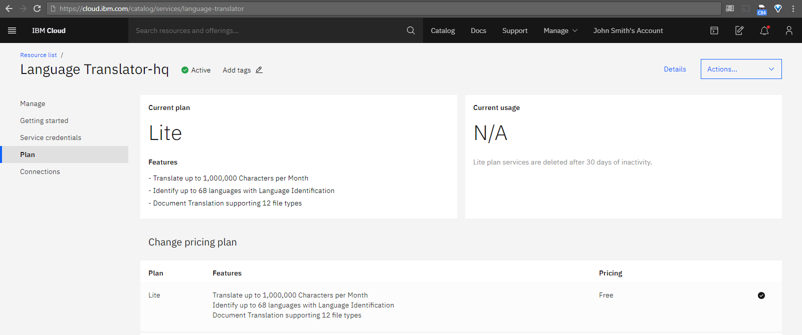
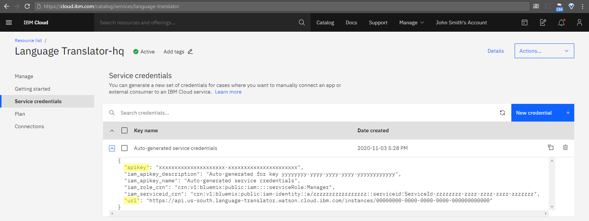

### IBM Cloud account

* links:
  - [Comparing account types](https://cloud.ibm.com/docs/account?topic=account-accounts)
  - [Lite plan services](https://cloud.ibm.com/catalog/?search=label:lite)

* summary:
  - Lite plan services are always free.
  - Lite plan services are deleted after 30 days of inactivity.
  - Your Lite account doesn't expire and your credit card isn't required.

### IBM Watson&trade; Language Translator service

* links:
  - [overview](https://www.ibm.com/watson/services/language-translator/)
  - [API documentation for using the service](https://cloud.ibm.com/apidocs/language-translator)
  - [list of supported languages](https://cloud.ibm.com/docs/language-translator?topic=language-translator-translation-models&locale=en-US#section-list-languages-supported)
  - [service dashboard for account](https://cloud.ibm.com/catalog/services/language-translator)

* screenshots of service dashboard:

